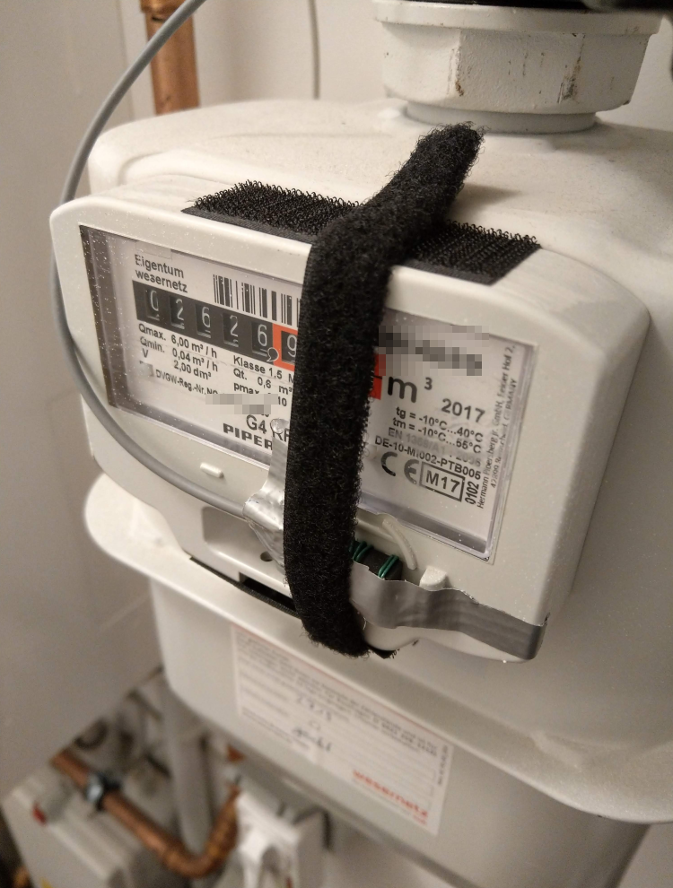
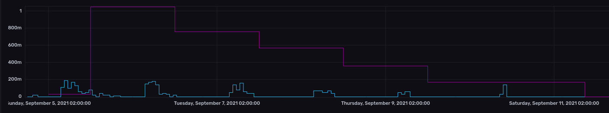

# Gasmeter reading using Raspberry Pi, an Inductive Proximity Sensor and InfluxDB

This project sets up a Raspberry Pi to read my gasmeter by a metal sensor. 
The gasmeter is a _Pipersberg G4 RF1 c_. 

The metal sensor must be placed on the gasmeter and will read each 0,01m3 consumption. 

The project is inspired by a blog post from [rutg3r.com](https://rutg3r.com/watermeter-reading-with-inductive-proximity-sensor/) and I adopted it to InfluxDB and gpiozero.

## Requirements

- A Raspberry Pi
- A Metal Inductive Proximity Sensor / Proximity switch operating at 5V. I use the _5V Metal Proximity Switch_ [by DFRobot](https://wiki.dfrobot.com/5V%20Metal%20Proximity%20Switch%20SKU%3A%20FIT0658)  

## Setup sensor

Connect the sensor to the Pi's GPIO pins:

| Sensor cable color | GPIO pin | Description |
| --- | --- | --- |
| Black | 6 | Ground |
| Brown | 4 | 5V |
| Blue | 7 (GPIO4) | Signal |

(see Pi's [Pin numbering](https://gpiozero.readthedocs.io/en/stable/recipes.html#pin-numbering))

Attach the sensor to the gasmeter and ensure, that the sensor light switches on/off on each 0,01m3 consumption.

See my setup for a reference: 

## Push readings to InfluxDB

Install Docker on the Raspberry Pi and bring up the Docker Compose file.

This will launch InfluxDB and a small Python script which forwards consumption readings at the GPIO pin to InfluxDB.

## Configure InfluxDB

Navigate to `http://<pi host>:8086` and create a Dashboard with the following query

```
consumption = from(bucket: "sensors")
  |> range(start: v.timeRangeStart, stop: v.timeRangeStop)
  |> filter(fn: (r) => r._measurement == "gas" and r._field == "consumption")
    
consumption
  |> aggregateWindow(every: 1h, fn: sum)
  |> yield(name: "/h")

consumption
  |> aggregateWindow(every: 1d, fn: sum)
  |> yield(name: "/d")
```

The Dashboard will show you a per hour and a per day consumption graph:

